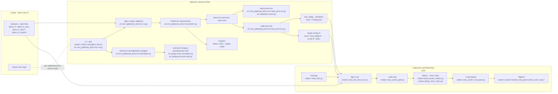

# 6. System Demonstration

## 6.1 Overview and deployment context
The delivered system is a local jailbreak/prompt-injection detector with a CLI-first interface (`jbd`) and two runtime detector backends: rules baseline and optional LoRA classifier (`src/llm_jailbreak_detector/cli.py`, `src/llm_jailbreak_detector/predict.py`).

Primary users are graders, examiners, and developers who need reproducible scoring on single prompts and JSONL batches without depending on external hosted safety APIs (`docs/REQUIREMENTS_SPEC.md`).

Primary demo mode for this thesis is **CLI-only local run** because it is the implemented and tested surface (`pyproject.toml`, `tests/test_cli_smoke.py`) and no FastAPI/Flask service entrypoint exists in runtime code.

Operational constraints:
- Offline/online: runtime inference is offline-capable by default (rules mode); LoRA mode uses local run artifacts and local HF cache (`src/llm_jailbreak_detector/lora_detector.py`).
- External API usage: **no external LLM API calls in runtime path** (`src/llm_jailbreak_detector/*`).
- Hardware: rules mode runs on CPU; LoRA inference defaults to CPU device in detector wrapper and can use CUDA in training/eval scripts when available (`src/llm_jailbreak_detector/lora_detector.py`, `scripts/train_lora.py`).
- Cost/rate limits: none from runtime API providers because no hosted inference API is called by the shipped detector package.
- Privacy boundary: prompts stay on the local machine unless operator exports files; batch outputs and evaluation artifacts can persist raw/sanitized text when explicitly written (`src/llm_jailbreak_detector/io.py`, `scripts/dump_error_cases.py`).

## 6.2 System architecture (Figure 6.1)


Unambiguous runtime data flow:
1. Input ingestion: `jbd predict` receives `--text`; `jbd batch` reads `.jsonl/.txt` via `iter_input_records` (`src/llm_jailbreak_detector/cli.py`, `src/llm_jailbreak_detector/io.py`).
2. Canonical template stage: upstream dataset ingestion stores model-facing text as `[PROMPT] ... [CONTEXT] ...` (`scripts/dataset_utils.py`, `scripts/ingest_bipia.py`, `scripts/ingest_jailbreakdb.py`).
3. Normalization/preprocess: optional inference normalization applies NFKC + Cf/Mn handling (`src/llm_jailbreak_detector/normalize.py`, `src/preprocess/normalize.py`); train/eval perturbation preprocessing is handled in `src/preprocess/unicode.py` and eval scripts.
4. Detector scoring: `Predictor` routes to either rules baseline or LoRA detector (`src/llm_jailbreak_detector/predict.py`).
5. Threshold decision: score is compared against threshold `tau`; rules default `0.5`, LoRA uses `val_threshold` from run config unless overridden (`src/llm_jailbreak_detector/predict.py`, `src/llm_jailbreak_detector/lora_detector.py`).
6. Output and logging: runtime emits JSON/JSONL with score/decision/threshold/model metadata and latency; evaluation scripts write metrics, tables, plots, and locked-pack artifacts (`src/llm_jailbreak_detector/cli.py`, `scripts/eval_week7_grid.py`, `scripts/build_week7_tables.py`, `scripts/lock_week7_eval_pack.py`).

Paper-consistency notes (Ch3 mapping):
- Ch3 normalization terms map to `normalize_train`/`normalize_infer` implementations (`scripts/train_lora.py`, `scripts/eval_lora_from_run.py`).
- Ch3 detector types map to rules baseline and LoRA classifier implementations (`src/baselines/rules.py`, `src/llm_jailbreak_detector/lora_detector.py`).
- Ch3 threshold policy maps to validation-selected `tau` at target FPR and fixed transfer across test splits (`src/eval/metrics.py`, `scripts/train_lora.py`, `scripts/eval_lora_from_run.py`).

## 6.3 Implementation details (repo-grounded)
Table-style module map:

| Module | Responsibility | Inputs | Outputs | Key symbols | Repo path(s) |
| --- | --- | --- | --- | --- | --- |
| CLI entrypoint | Parse command surface and dispatch command handlers | command args | stdout JSON / output JSONL / exit codes | `main`, `_run_predict`, `_run_batch`, `_run_normalize`, `_run_doctor` | `src/llm_jailbreak_detector/cli.py` |
| Predictor router | Select detector backend and apply thresholding | text, detector, threshold, normalize flags | `PredictionResult` (`score`, `label`, `threshold`, metadata) | `Predictor`, `_resolve_threshold`, `predict` | `src/llm_jailbreak_detector/predict.py` |
| Rules detector | Offline regex baseline scoring | text | score in `[0,1]` | `RulesDetector.score` | `src/baselines/rules.py`, `src/llm_jailbreak_detector/rules_detector.py` |
| LoRA detector | Local model loading and probability inference | text, run_dir | attack probability score | `LoraDetector._load_model`, `predict_proba` | `src/llm_jailbreak_detector/lora_detector.py` |
| Normalization | NFKC + character-category cleanup | text, `drop_mn` flag | normalized text | `normalize_text` | `src/llm_jailbreak_detector/normalize.py`, `src/preprocess/normalize.py` |
| Batch I/O | Parse jsonl/txt and write jsonl | input path / rows | iterator / output file | `iter_input_records`, `write_jsonl` | `src/llm_jailbreak_detector/io.py` |
| Eval grid/reporting | Run split evaluations and build thesis tables | run dirs, split files, metrics | `final_metrics_*.json`, tables, error-cases, locked pack | `eval_week7_grid.py`, `build_week7_tables.py`, `dump_error_cases.py`, `lock_week7_eval_pack.py` | `scripts/*`, `reports/week7/locked_eval_pack/week7_norm_only/*` |

Threshold `tau` origin and override:
- `tau` is selected from validation using target FPR logic (`tpr_at_fpr`) and persisted in run config as `val_threshold` (`src/eval/metrics.py`, `scripts/train_lora.py`).
- During LoRA eval/runtime, the same persisted threshold is loaded and transferred unless user explicitly overrides via CLI `--threshold` (`scripts/eval_lora_from_run.py`, `src/llm_jailbreak_detector/predict.py`).
- Week 7 final run documents `val_threshold ~= 0.7340` for `week7_norm_only` (`runs/week7_norm_only/config.json`, `reports/week7/locked_eval_pack/week7_norm_only/RUN_CONFIG_SNAPSHOT.md`).

System-only features (implemented but not central in Ch3-Ch5 narrative):
- `jbd doctor` environment diagnostics command (`src/llm_jailbreak_detector/cli.py`).
- Runtime output telemetry fields `latency_ms`, `model_version`, and `decision` for demo observability (`src/llm_jailbreak_detector/cli.py`).

## 6.4 Interfaces (CLI contract)
Table 6.1 is derived from `docs/MODULE_INTERFACES.md`.

| Command | Inputs | Outputs | Determinism/seed | Common errors |
| --- | --- | --- | --- | --- |
| `jbd predict` | Required: `--text`; optional: `--detector rules\|lora`, `--run_dir`, `--threshold`, `--normalize`, `--drop-mn`, `--id` | JSON fields include `score`, `label`, `decision`, `threshold_used`, `model_version`, `latency_ms`, optional `rationale` (`null` currently), plus compatibility fields `threshold`, `flagged`, `detector`, `normalize_infer` | Deterministic for fixed detector/threshold/input; latency is non-deterministic | missing `run_dir` for LoRA, invalid threshold format, missing local weights/deps |
| `jbd batch` | Required: `--input`, `--output`; same detector/threshold/normalization flags as predict | JSONL rows with same scoring schema as `predict` | Deterministic scoring per row for fixed input order/config; per-row latency varies | invalid JSONL, missing `text` field, inaccessible output path |
| `jbd normalize` | Required: `--text`; optional `--drop-mn` | Normalized text (no score fields) | Deterministic text transform | invalid argument parsing |
| `jbd doctor` | No extra arguments | environment diagnostics text | Deterministic given environment state | dependency import checks may report missing optional packages |

Error handling and failure behavior:
- Missing weights/artifacts: LoRA path raises clear errors (`Missing config.json`, `Missing lora_adapter`, local model cache missing) and CLI exits with code `2` (`src/llm_jailbreak_detector/lora_detector.py`, `src/llm_jailbreak_detector/cli.py`).
- Invalid JSONL: batch parser raises on malformed JSON or missing `text`, CLI exits code `2` (`src/llm_jailbreak_detector/io.py`, `src/llm_jailbreak_detector/cli.py`).
- GPU unavailable: no hard failure in default demo mode; rules runs on CPU; LoRA wrapper defaults to `device="cpu"` (`src/llm_jailbreak_detector/lora_detector.py`).
- Timeout/retry: runtime CLI has no internal retry loop; failures surface immediately to caller.
- Fallback behavior: CLI prints LoRA hint to switch to offline rules mode when LoRA path errors (`src/llm_jailbreak_detector/cli.py`).

## 6.5 Demo and reproducibility package
Full scripted walkthrough is in `demo/DEMO_SCRIPT.md` with sample inputs in `demo/sample_inputs.jsonl` and expected rules-mode behavior in `demo/expected_outputs.jsonl`.

Short live demo sequence (grader-proof):
1. Setup and install (`python -m venv .venv`, `pip install -e .`).
2. Smoke (`jbd --help`, `jbd doctor`).
3. Benign run (expect allow).
4. Obvious jailbreak run (expect block).
5. Hard-negative run (show false-positive risk and manual-review policy).
6. Adv2/rewrite-style runs (show known false-negative mode honestly).
7. Batch run to artifact file (`demo/out_rules.jsonl`).
8. Failure-path checks: missing LoRA run_dir, invalid JSONL.

### Reproducibility checklist
Commands to regenerate Ch4/Ch5 quantitative assets (requires local `runs/` + datasets):
```bash
python scripts/eval_week7_grid.py --run_manifest reports/week7/run_manifest.json --out_dir reports/week7
python scripts/build_week7_tables.py --metrics_root reports/week7/metrics --out_dir reports/week7/results --runs_root runs --control_run week7_control
python scripts/lock_week7_eval_pack.py --run_id week7_norm_only --overwrite --rationale "Lock final Week 7 thesis pack"
```

Threshold/calibration regeneration example:
```bash
python scripts/calibrate_threshold.py --pred_path runs/week7_norm_only/predictions_test_main_adv2.jsonl --targets 0.01,0.05 --out_dir reports/week5/thresholds --out_prefix threshold_adv2
```

Seed and config controls:
- training seed: `--seed` in `scripts/train_lora.py` (default `42`)
- augmentation seed: `--aug_seed` in `scripts/train_lora.py` (default `42`)
- runtime threshold override: CLI `--threshold`; default LoRA threshold from `run_dir/config.json`

Hardware notes:
- CPU-only path is sufficient for rules-mode demo.
- LoRA training/eval scripts can use CUDA when available; final run metadata records device and commit (`runs/week7_norm_only/config.json`).

### Paper-System-Repo traceability matrix

| Claimed component | Thesis ref (Ch3/4/5) | Ch6 ref | Repo path(s) | Status | Notes/Fix |
| --- | --- | --- | --- | --- | --- |
| Canonical text template + escaping | Ch3.2 | 6.2/6.3 | `scripts/dataset_utils.py`, `scripts/ingest_bipia.py`, `scripts/ingest_jailbreakdb.py` | Partial | Template implemented; explicit escaping of marker tokens is not enforced. Minimal fix: escape marker substrings inside `format_text`. |
| Normalization config | Ch3.3 | 6.2/6.3 | `src/preprocess/normalize.py`, `src/preprocess/unicode.py`, `scripts/train_lora.py`, `scripts/eval_lora_from_run.py` | Implemented | Separate train and infer controls. |
| Detectors: rules + LoRA | Ch3.4, Ch4 | 6.3 | `src/baselines/rules.py`, `src/llm_jailbreak_detector/rules_detector.py`, `src/llm_jailbreak_detector/lora_detector.py` | Implemented | Runtime selects one backend via CLI. |
| Threshold `tau` selection + usage | Ch3.5/3.6, Ch4/Ch5 | 6.2/6.3/6.5 | `src/eval/metrics.py`, `scripts/train_lora.py`, `scripts/eval_lora_from_run.py` | Implemented | Validation-derived threshold transferred unchanged to test splits. |
| Perturbation evaluation scripts | Ch4/Ch5 | 6.3/6.5 | `scripts/eval_week7_grid.py`, `scripts/make_adv2_set.py`, `scripts/make_rewrite_set.py`, `scripts/make_unicode_adversarial_set.py` | Implemented | Split families and generators are versioned. |
| Locked eval pack pipeline | Ch4/Ch5 | 6.5 | `scripts/build_week7_tables.py`, `scripts/lock_week7_eval_pack.py`, `reports/week7/locked_eval_pack/week7_norm_only/*` | Implemented | Aggregate package used by thesis. |
| Error-case export | Ch4/Ch5 | 6.5 | `scripts/dump_error_cases.py`, `reports/week7/locked_eval_pack/week7_norm_only/error_cases/*` | Implemented | FP/FN export is reproducible from prediction files. |

Full matrix (with additional notes) is in `docs/TRACEABILITY_MATRIX.md`.

### Reviewer questions (Q1-Q5)
Direct answers with evidence pointers are in `docs/CH6_REVIEWER_QA.md`. Key points:
- Q2 external runtime API calls: no, offline classifier inference path.
- Q3 primary demo mode: CLI-only local run.
- Q4 demo video: no link in repo; scripted live demo package provided.
- Q5 model topology: single selected detector backend (`rules` or `lora`), no ensemble.

### Ops, security, and privacy
Operational policy details are documented in `docs/OPS_SECURITY_PRIVACY.md`. Core points:
- no runtime API-key dependency for shipped detector;
- prompt text can be persisted if operator requests output files, so redaction policy is operator-controlled;
- version stamping and environment snapshots are captured in run config and locked pack metadata.
