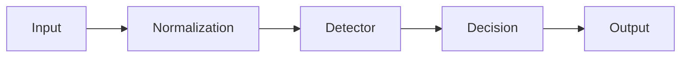

# High-Level Design

## Pipeline

## Components

- CLI: `jbd` exposes predict/batch/normalize commands.
- Core library: normalization + unified prediction interface.
- Detectors: rules baseline and optional LoRA-backed model.
- Metrics/eval scripts: existing scripts under `scripts/` and reports under `reports/`.

## Non-functional notes

- Reproducibility: run directories include `config.json`, metrics, and thresholds.
- Artifact management: large runs and datasets stay outside git; reports point to locked eval packs.
- Offline mode: rules detector runs without network access; LoRA requires local artifacts and HF cache.
