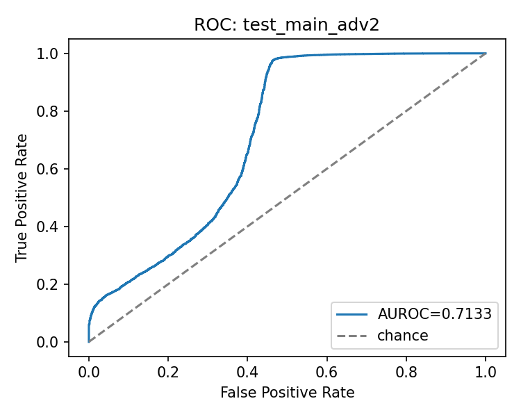
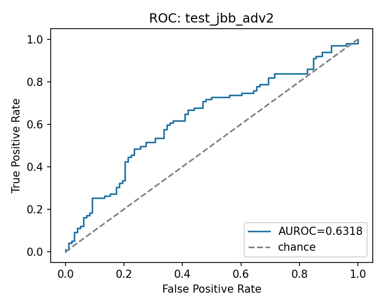
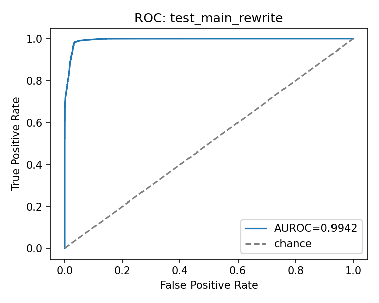

# Robustness

Final model = week7_norm_only; justification: improves adv2 transfer without JBB adv2 recall collapse.

## Threat model
- unicode: Unicode mixing applied at evaluation time to test normalization robustness.
- adv2: character-level perturbations (homoglyphs, mixed-script, noise).
- rewrite: light paraphrases (synonyms, fillers, minor reordering).

## Evaluation protocol
- Locked evaluation grid with normalize_infer OFF; final model uses normalize_train ON.
- The val_threshold from run config.json is transferred unchanged to every split.
- All figures and error case links must point inside (reports/week7/locked_eval_pack/week7_norm_only/).

## Table A: Clean + Unicode
| run | split | auroc | auprc | val_threshold | fpr_at_val_threshold | tpr_at_val_threshold | asr_at_threshold |
| --- | --- | --- | --- | --- | --- | --- | --- |
| week7_adv2_only | val | 0.9982 | 0.9982 | 0.5624 | 0.0097 | 0.9729 | 0.0271 |
| week7_adv2_only | test_main | 0.9942 | 0.9994 | 0.5624 | 0.0607 | 0.9970 | 0.0030 |
| week7_adv2_only | test_jbb | 0.8962 | 0.8942 | 0.5624 | 0.6939 | 0.9899 | 0.0101 |
| week7_adv2_only | test_main_unicode | 0.9933 | 0.9992 | 0.5624 | 0.0642 | 0.9969 | 0.0031 |
| week7_adv2_only | test_jbb_unicode | 0.8393 | 0.8322 | 0.5624 | 0.7551 | 1.0000 | 0.0000 |
| week7_control | val | 0.9982 | 0.9982 | 0.6894 | 0.0097 | 0.9709 | 0.0291 |
| week7_control | test_main | 0.9960 | 0.9996 | 0.6894 | 0.0311 | 0.9878 | 0.0122 |
| week7_control | test_jbb | 0.9078 | 0.9033 | 0.6894 | 0.5918 | 0.9798 | 0.0202 |
| week7_control | test_main_unicode | 0.9951 | 0.9995 | 0.6894 | 0.0423 | 0.9858 | 0.0142 |
| week7_control | test_jbb_unicode | 0.8857 | 0.8800 | 0.6894 | 0.7041 | 0.9697 | 0.0303 |
| week7_norm_only | val | 0.9983 | 0.9982 | 0.7340 | 0.0094 | 0.9696 | 0.0304 |
| week7_norm_only | test_main | 0.9958 | 0.9996 | 0.7340 | 0.0311 | 0.9869 | 0.0131 |
| week7_norm_only | test_jbb | 0.8890 | 0.8747 | 0.7340 | 0.5816 | 0.9798 | 0.0202 |
| week7_norm_only | test_main_unicode | 0.9949 | 0.9994 | 0.7340 | 0.0429 | 0.9862 | 0.0138 |
| week7_norm_only | test_jbb_unicode | 0.8814 | 0.8704 | 0.7340 | 0.6531 | 0.9798 | 0.0202 |
| week7_norm_plus_adv2 | val | 0.9979 | 0.9977 | 0.6815 | 0.0094 | 0.9659 | 0.0341 |
| week7_norm_plus_adv2 | test_main | 0.9929 | 0.9992 | 0.6815 | 0.0566 | 0.9944 | 0.0056 |
| week7_norm_plus_adv2 | test_jbb | 0.9018 | 0.8950 | 0.6815 | 0.6122 | 0.9798 | 0.0202 |
| week7_norm_plus_adv2 | test_main_unicode | 0.9920 | 0.9991 | 0.6815 | 0.0582 | 0.9959 | 0.0041 |
| week7_norm_plus_adv2 | test_jbb_unicode | 0.8892 | 0.8744 | 0.6815 | 0.6735 | 0.9697 | 0.0303 |

## Table B: Adv2 + Rewrite
| run | split | auroc | auprc | val_threshold | fpr_at_val_threshold | tpr_at_val_threshold | asr_at_threshold |
| --- | --- | --- | --- | --- | --- | --- | --- |
| week7_adv2_only | test_main_adv2 | 0.9833 | 0.9979 | 0.5624 | 0.0985 | 0.9856 | 0.0144 |
| week7_adv2_only | test_jbb_adv2 | 0.6415 | 0.6689 | 0.5624 | 0.6633 | 0.7677 | 0.2323 |
| week7_adv2_only | test_main_rewrite | 0.9912 | 0.9990 | 0.5624 | 0.0801 | 0.9977 | 0.0023 |
| week7_adv2_only | test_jbb_rewrite | 0.8870 | 0.8918 | 0.5624 | 0.6939 | 0.9899 | 0.0101 |
| week7_control | test_main_adv2 | 0.6547 | 0.9379 | 0.6894 | 0.6826 | 0.9731 | 0.0269 |
| week7_control | test_jbb_adv2 | 0.6007 | 0.5727 | 0.6894 | 0.8980 | 0.9495 | 0.0505 |
| week7_control | test_main_rewrite | 0.9934 | 0.9992 | 0.6894 | 0.0537 | 0.9896 | 0.0104 |
| week7_control | test_jbb_rewrite | 0.8993 | 0.8907 | 0.6894 | 0.6020 | 0.9798 | 0.0202 |
| week7_norm_only | test_main_adv2 | 0.7133 | 0.9523 | 0.7340 | 0.6403 | 0.9967 | 0.0033 |
| week7_norm_only | test_jbb_adv2 | 0.6318 | 0.6294 | 0.7340 | 0.8469 | 0.8990 | 0.1010 |
| week7_norm_only | test_main_rewrite | 0.9942 | 0.9994 | 0.7340 | 0.0531 | 0.9902 | 0.0098 |
| week7_norm_only | test_jbb_rewrite | 0.8956 | 0.8964 | 0.7340 | 0.5714 | 0.9899 | 0.0101 |
| week7_norm_plus_adv2 | test_main_adv2 | 0.9833 | 0.9979 | 0.6815 | 0.0947 | 0.9831 | 0.0169 |
| week7_norm_plus_adv2 | test_jbb_adv2 | 0.6329 | 0.6506 | 0.6815 | 0.5408 | 0.6768 | 0.3232 |
| week7_norm_plus_adv2 | test_main_rewrite | 0.9905 | 0.9990 | 0.6815 | 0.0718 | 0.9968 | 0.0032 |
| week7_norm_plus_adv2 | test_jbb_rewrite | 0.8754 | 0.8701 | 0.6815 | 0.6224 | 0.9798 | 0.0202 |

## Table C: Threshold Transfer
| run | split | fpr_at_val_threshold | tpr_at_val_threshold | asr_at_threshold |
| --- | --- | --- | --- | --- |
| week7_adv2_only | test_main | 0.0607 | 0.9970 | 0.0030 |
| week7_adv2_only | test_main_unicode | 0.0642 | 0.9969 | 0.0031 |
| week7_adv2_only | test_main_adv2 | 0.0985 | 0.9856 | 0.0144 |
| week7_adv2_only | test_main_rewrite | 0.0801 | 0.9977 | 0.0023 |
| week7_adv2_only | test_jbb_adv2 | 0.6633 | 0.7677 | 0.2323 |
| week7_adv2_only | test_jbb_rewrite | 0.6939 | 0.9899 | 0.0101 |
| week7_control | test_main | 0.0311 | 0.9878 | 0.0122 |
| week7_control | test_main_unicode | 0.0423 | 0.9858 | 0.0142 |
| week7_control | test_main_adv2 | 0.6826 | 0.9731 | 0.0269 |
| week7_control | test_main_rewrite | 0.0537 | 0.9896 | 0.0104 |
| week7_control | test_jbb_adv2 | 0.8980 | 0.9495 | 0.0505 |
| week7_control | test_jbb_rewrite | 0.6020 | 0.9798 | 0.0202 |
| week7_norm_only | test_main | 0.0311 | 0.9869 | 0.0131 |
| week7_norm_only | test_main_unicode | 0.0429 | 0.9862 | 0.0138 |
| week7_norm_only | test_main_adv2 | 0.6403 | 0.9967 | 0.0033 |
| week7_norm_only | test_main_rewrite | 0.0531 | 0.9902 | 0.0098 |
| week7_norm_only | test_jbb_adv2 | 0.8469 | 0.8990 | 0.1010 |
| week7_norm_only | test_jbb_rewrite | 0.5714 | 0.9899 | 0.0101 |
| week7_norm_plus_adv2 | test_main | 0.0566 | 0.9944 | 0.0056 |
| week7_norm_plus_adv2 | test_main_unicode | 0.0582 | 0.9959 | 0.0041 |
| week7_norm_plus_adv2 | test_main_adv2 | 0.0947 | 0.9831 | 0.0169 |
| week7_norm_plus_adv2 | test_main_rewrite | 0.0718 | 0.9968 | 0.0032 |
| week7_norm_plus_adv2 | test_jbb_adv2 | 0.5408 | 0.6768 | 0.3232 |
| week7_norm_plus_adv2 | test_jbb_rewrite | 0.6224 | 0.9798 | 0.0202 |

## Table D: Ablation Effects (Delta vs Control)
| run | group | mean_auroc | mean_auprc | mean_fpr | mean_tpr | mean_asr | delta_fpr_vs_control | delta_tpr_vs_control | delta_asr_vs_control |
| --- | --- | --- | --- | --- | --- | --- | --- | --- | --- |
| week7_adv2_only | clean | 0.9452 | 0.9468 | 0.3773 | 0.9935 | 0.0065 | 0.0658 | 0.0097 | -0.0097 |
| week7_adv2_only | unicode | 0.9163 | 0.9157 | 0.4096 | 0.9985 | 0.0015 | 0.0365 | 0.0207 | -0.0207 |
| week7_adv2_only | adv2 | 0.8124 | 0.8334 | 0.3809 | 0.8766 | 0.1234 | -0.4094 | -0.0847 | 0.0847 |
| week7_adv2_only | rewrite | 0.9391 | 0.9454 | 0.3870 | 0.9938 | 0.0062 | 0.0591 | 0.0091 | -0.0091 |
| week7_control | clean | 0.9519 | 0.9514 | 0.3115 | 0.9838 | 0.0162 | 0.0000 | 0.0000 | 0.0000 |
| week7_control | unicode | 0.9404 | 0.9397 | 0.3732 | 0.9778 | 0.0222 | 0.0000 | 0.0000 | 0.0000 |
| week7_control | adv2 | 0.6277 | 0.7553 | 0.7903 | 0.9613 | 0.0387 | 0.0000 | 0.0000 | 0.0000 |
| week7_control | rewrite | 0.9463 | 0.9450 | 0.3279 | 0.9847 | 0.0153 | 0.0000 | 0.0000 | 0.0000 |
| week7_norm_only | clean | 0.9424 | 0.9371 | 0.3064 | 0.9834 | 0.0166 | -0.0051 | -0.0004 | 0.0004 |
| week7_norm_only | unicode | 0.9381 | 0.9349 | 0.3480 | 0.9830 | 0.0170 | -0.0252 | 0.0052 | -0.0052 |
| week7_norm_only | adv2 | 0.6726 | 0.7908 | 0.7436 | 0.9478 | 0.0522 | -0.0466 | -0.0135 | 0.0135 |
| week7_norm_only | rewrite | 0.9449 | 0.9479 | 0.3122 | 0.9900 | 0.0100 | -0.0156 | 0.0053 | -0.0053 |
| week7_norm_plus_adv2 | clean | 0.9473 | 0.9471 | 0.3344 | 0.9871 | 0.0129 | 0.0229 | 0.0033 | -0.0033 |
| week7_norm_plus_adv2 | unicode | 0.9406 | 0.9368 | 0.3658 | 0.9828 | 0.0172 | -0.0074 | 0.0050 | -0.0050 |
| week7_norm_plus_adv2 | adv2 | 0.8081 | 0.8243 | 0.3178 | 0.8300 | 0.1700 | -0.4725 | -0.1313 | 0.1313 |
| week7_norm_plus_adv2 | rewrite | 0.9330 | 0.9345 | 0.3471 | 0.9883 | 0.0117 | 0.0193 | 0.0036 | -0.0036 |

## Key plots

ROC curve for adv2 on test_main (week7_norm_only).

ROC curve for adv2 on test_jbb (week7_norm_only).

ROC curve for rewrite on test_main (week7_norm_only).

## Failure analysis
- [test_main_adv2_fp](../reports/week7/locked_eval_pack/week7_norm_only/error_cases/test_main_adv2_fp.md): benign-labeled prompts with heavy mixed-script noise saturate the score.
- [test_main_adv2_fn](../reports/week7/locked_eval_pack/week7_norm_only/error_cases/test_main_adv2_fn.md): obfuscated harmful requests fall below the fixed threshold.
- [test_jbb_adv2_fp](../reports/week7/locked_eval_pack/week7_norm_only/error_cases/test_jbb_adv2_fp.md): JBB prompts with obfuscation or sensitive topics are flagged as attacks.
- [test_jbb_adv2_fn](../reports/week7/locked_eval_pack/week7_norm_only/error_cases/test_jbb_adv2_fn.md): recall drops on JBB adv2 when attack intent is heavily masked.
- [test_main_rewrite_fp](../reports/week7/locked_eval_pack/week7_norm_only/error_cases/test_main_rewrite_fp.md): filler-heavy paraphrases on benign tasks trigger high scores.
- [test_main_rewrite_fn](../reports/week7/locked_eval_pack/week7_norm_only/error_cases/test_main_rewrite_fn.md): paraphrased attack requests become less explicit and slip under threshold.

## Summary + so what
Normalization-only provides the safest transfer: adv2 robustness improves without the JBB adv2 recall collapse seen under adv2-heavy training, while clean/unicode performance stays essentially unchanged. This makes week7_norm_only a defensible operating point for the thesis, balancing robustness gains against distribution-shift risk.
